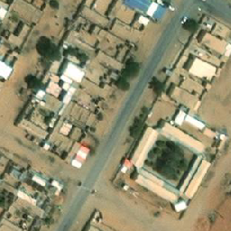
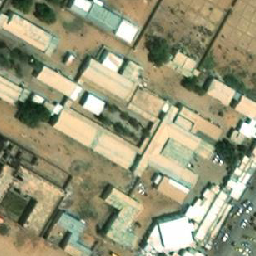
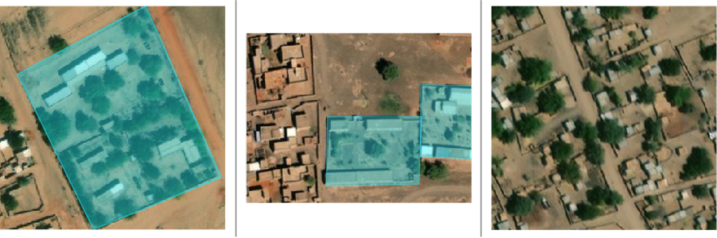
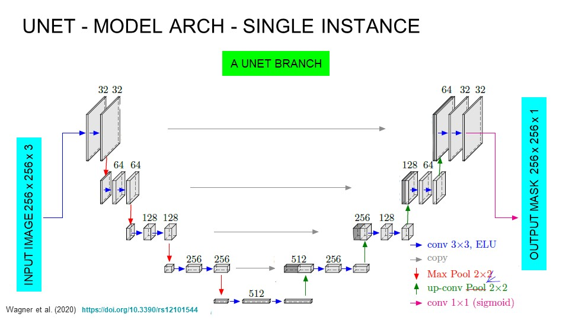
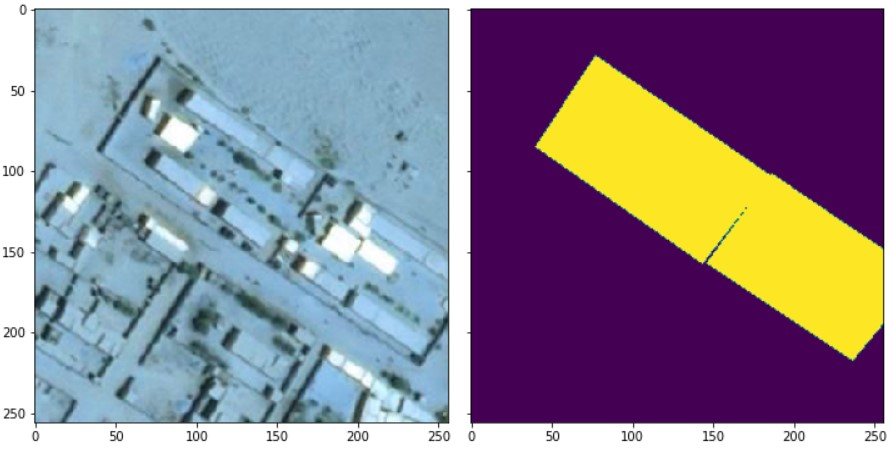
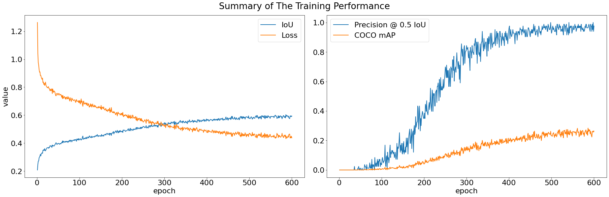
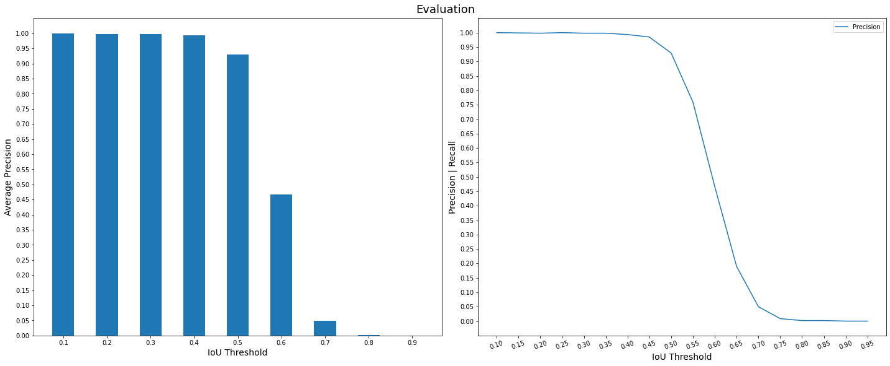

# UNICEF-Giga_Sudan
## INTRODUCTION
This repo shows my contribution as an ML engineer to the UNICEF-Giga project organized by [Omdena](https://omdena.com/projects/omdenalorexgiga/) to help connect schools in developing nations worldwide to the internet. For a more detailed walkthrough to the technical solution please click the colab icon below:

or download the notebook in this repo at  
 <a href="./Walkthrough_Model_Development.ipynb" target="_blank">Walkthrough_Model_Development.ipynb</a> 
 

### Giga:
 The <a href="https://www.unicef.org/innovation/giga" target="_blank">UNICEF Office of Innovation</a> describes Giga as:

> Giga, an initiative launched by UNICEF and ITU in September 2019 to connect every school to the Internet and every young person to information, opportunity and choice, is supporting the response to COVID-19, as well as looking at how connectivity can create stronger infrastructures of hope and opportunity in the "time after COVID."

Giga's effort is mainly focused on developing nations, where its often the case that school records are  either noncomplete or entirely nonexistent, with a lot of non-official locally sourced schools. Giga's team could benefit from an automated school discovery and localization solution to assit their mission with speed and efficiency, while reducing the costs and the often scarce manpower involved in ground surveys.

[Omdena](https://omdena.com/) is an "AI for Good" company that summons voluneering efforts worldwide to develop and deploy AI tools for positive impact. Omdena organized this volunteer effort to develop an AI solution for the UNICEF to support Giga's mission. I had the honour of making a contribution to such endeavor, shown here in this repo.
## PROBLEM STATMENT:
Giga is resorting to satellite imagery instead of ground surveys to locate schools worldwide. Satellite imagery provides wide coverage and speed. Giga is developing AI systems that utilize these satellite data to automate the detection of schools, with a focus on higher recall rates, but also at an adequate precision. ***A recall first*** principle helps Giga to discover and include as much schools as possible, while maintaining an adequate precision supresses the ***false positives***, thus preventing the burnout of their ground response teams.

The main ROI in this project is Southern Sudan. Giga already developed a model that can classify if a satellite image contain a school or not. The task for this project is to develop an object recognition and localization model to localize the school building within a given ***school*** satellite image.

The target localization model would enhance Giga's automated school detection system by providing a localization/segmentation function on top of their existing classification model.

The detection models would be evaluated mainly using the ***mean average precision (mAP)*** metric for the detection masks.
## THE DATA
For this project, Giga's team obtained a dataset of 6557 RGB satellite images of size 256 x 256 for Southern Sudan, which is their current ROI. Examples of the provided imagery:

    
    
     
    <i>Satellite tiles from the <b>school</b> class.</i> 

## THE SUPERVISION SIGNAL
Our labeling team, lead by [Sanchit Bhavsar](https://www.linkedin.com/in/sanchit-bhavsar-2aa0ba92/) annotated and reviewed Giga's dataset using [Labelbox](https://labelbox.com). Notable efforts were from [Nashwa Shokry](linkedin.com/in/nashwa-shokry-3b400630) and Purti Sharma.

The labels were exported to a json file in the COCO format. Below is an example of the segmenation polygons annotated by the labeling team:

      
    <i><b>Left</b>: A single school polygon label | <b>Middle</b>: Multiple school polygons | <b>Right</b>: A non-school tile.</i>  

After cleaning the dataset and removing duplicates, the school class included 5223 annotated images.

## THE PROPOSED SOLUTION:
My approach is to treat this task as a segmentation task. I've developed a UNET model that segments the school regions from the given satellite image. Below is a high level view of the model architecture.

     
    <i> Wagner et al.(2020) 
    <a href="https://doi.org/10.3390/rs12101544" >https://doi.org/10.3390/rs12101544 </a> </i>  

The labels had to be preprocessed to create binary segmenation masks as training targets. The final supervision signal looks like the image below:

   
  <i> <b> Left:</b> Input tile | <b> Right:</b> Segmentation target. </i>
   

## TRAINING & EVALUATION:
The school class was divided into 3 sets: 3342 images for training, 836 images for validation and 1045 images for testing.

The model has been trained for 600 epochs with the optimizer ***Adam*** to minimize the compound ***BCEDice_loss*** function (Dice + BCE). Training was divided into 3 main steps of 200 epochs each. The learning rate started at $1e^{-3}$ at step 1, (i.e, epochs interval $[0, 200]$); set to $1e^{-4}$ at step 2, (i.e, interval $[200, 400]$), and finally was set to $1e^{-5}$ at the final step, (i.e, interval $[400, 600]$).

### TRAINING PERFORMANCE:
The loss function was minimized to 0.437 and training ***IoU*** score reached 0.6. The ***Precision @ 0.5 IoU*** of the predicted masks reached 0.976 at the end of training.

    

### TEST PERFORMANCE:
The model scored an ***IoU*** score of 0.6 on the testset. The test ***Precision @ 0.5 IoU*** scored 0.931 and the ***COCO mAP*** scored 0.296. Below is ***precision curve*** per *IoU* Threshold:

  

### PREDICTION POST-PROCESSING & VISUAL INSPECTION:
The predicted masks are post-processed to eliminate orphaned mask regions, smaller than 1000 pixels of size. A bounding box is drawn on the remaining regions. Below is an example of 25 predictions from the testset:

        
        <figcaption> <i> Testset predicted masks in blue with BBox overlays. 
        Single and muliple detections per tile.</i> </figcaption>
</figure>

 

## FUTURE WORK
The next step for this project is deployment using Kubernetes on a cloud service.
