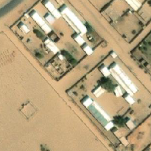

# UNICEF-Giga_Sudan
## INTRODUCTION
This notebook demonstrates the problem statment expressed by the UNICEF's Giga team and the proposed solution to solve it.

> Giga, an initiative launched by UNICEF and ITU in September 2019 to connect every school to the Internet and every young person to information, opportunity and choice, is supporting the response to COVID-19, as well as looking at how connectivity can create stronger infrastructures of hope and opportunity in the "time after COVID."
<a href="https://www.unicef.org/innovation/giga" target="_blank">

UNICEF Office of Innovation</a>

Giga's effort is mainly focused in developing nations, where its oftent the case of either noncomplete or entirely nonexistent school records. Giga's team could benifit from an automated school discovery and locatization solution to assit their mission with speed and efficiency while reducing the often scarce costs and labour of on-site surveys.
### Problem Statment:
In this project, Giga's team obtained a dataset of 6557 RGB satellite images of size 256 x 256 of Southern Sudan. Giga already developed a model that can classify if a satellite image either contain a school or not. 

The task for this project is to develop an object recognition and localozation model to localize the school building within a given ***school*** satellite image.

The target localization model would enhance Giga's automated school detection system by providing a localization/segmentation function on top of their existing classification model.

### The Dataset
Examples of the provided imagery:
  

### The Supervision Signal
Our labeling team annottated and reviewe Giga's dataset using LabelBox. The effort was lead by Sanchit wth notabel efforts by Nashwa and Purtri et al.

The labels were exported to a json file in the COCO format. Below is an example of the segmenation polygons annotated by the labeling team:

### The Proposed Solution:
My approach is to treat this task as a segmentation task. I've developed a UNET model that segments the school region from the given satellite image. Below is a high level view of the model architecture.

  

The labels had to be preprocessed to create binary segmenation masks as the training targets. The final supervision signal looks like the image below:

  

### Training and Evaluation:
The model has been trained for 600 epochs with the optimizer **Adam**. Training was divided into 3 main steps of 200 epochs each. The learning rate started at $1e^{-3}$ at step 1, (i.e, epochs interval $[0, 200]$); set to $1e^{-4}$ at step 2, (i.e, interval $[200, 400]$), and finally was set to $1e^{-5}$ at the final step, (i.e, interval $[400, 600]$).
